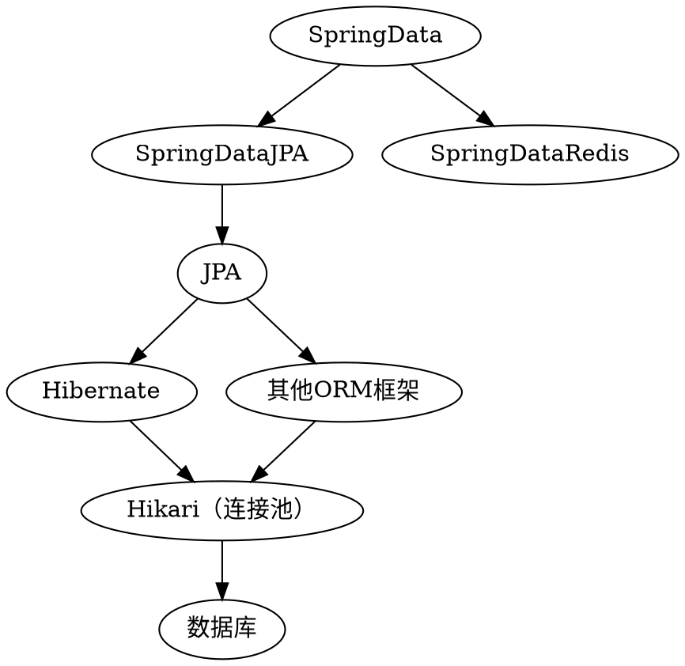

# SpringData

[TOC]

## JPA

### 概念

#### JPA
* Java Persistence API
* 一套Java持久化规范
* 提供了一套标准的接口和抽象类
* 功能：
	* ORM映射元数据：描述对象和表之间的映射关系
	* Java持久化API：执行增、删、改、查操作
	* JPQL：通过面向对象的方式查询数据

#### SpringDataJPA
* 一套JPA应用框架
* 功能：
	* Repository
	* Objects映射
	* Template


#### 关系



### 实体注解

#### 标注
* `@Entity` 声明实体类
* `@Table`  声明表名
* `@Column` 声明字段
* `@Id`     声明主键
* `@GeneratedValue` 声明自动生成规则

#### 示例
```kotlin
@Entity
@Table(name = "Users")
class User {
	@Id
	private var id: Long

	@Column(length = 64)
	private var name: String

	@Column(length = 64)
	private var password: String
}
```


### Repository

#### 生成
* 继承`JPARepository`
* 添加`@Repository`

#### 预生成方法
* 实现了访问数据库的关键接口
* `existsById()`
* `save()`
* `findAll()`,`findById()`
* `delete()`, `deleteById()`


#### 自定义方法
* JPA会根据方法名自动生成SQL
* 支持单个属性查询，多个属性组合查询
* 支持SQL的关键字（like, between）

##### 格式
* `findByXXX()`, `queryByXXX()`
* `getByXXX()`, `readByXXX()`
* `countByXXX()`

##### 示例
```kotlin
findByNameOrPassword(name: String, password: String): User
findByUserName(userName: String): User
```


#### 自定义SQL
* 添加`@Query`
* 注解内写JPQL


### 其他库
* QueryDSL：通用查询框架，用于动态构建SQL