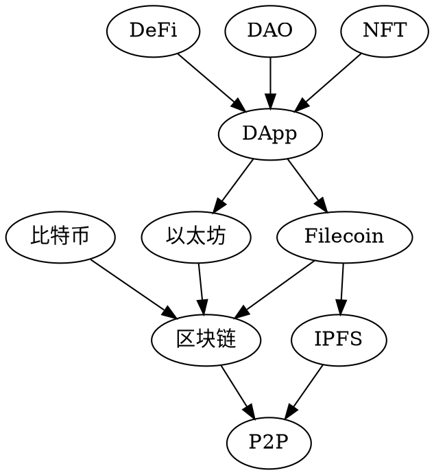

# 整体

## 图示

## 概述

* 比特币：基于区块链的数字货币
* 以太坊：基于区块链的互联网应用平台

* 区块链：保证最终一致性的分布式数据库

* IPFS：一个分布式文件系统
* Filecoin：IPFS上的激励层，基于区块链的分布式存储网络

* DApp：基于智能合约的去中心化应用
* DeFi：去中心化金融，一种DApp，运行金融类型的智能合约
* DAO：去中心化自治组织，通过智能合约进行约束
* NFT：不可互换的代币，用于游戏、艺术品