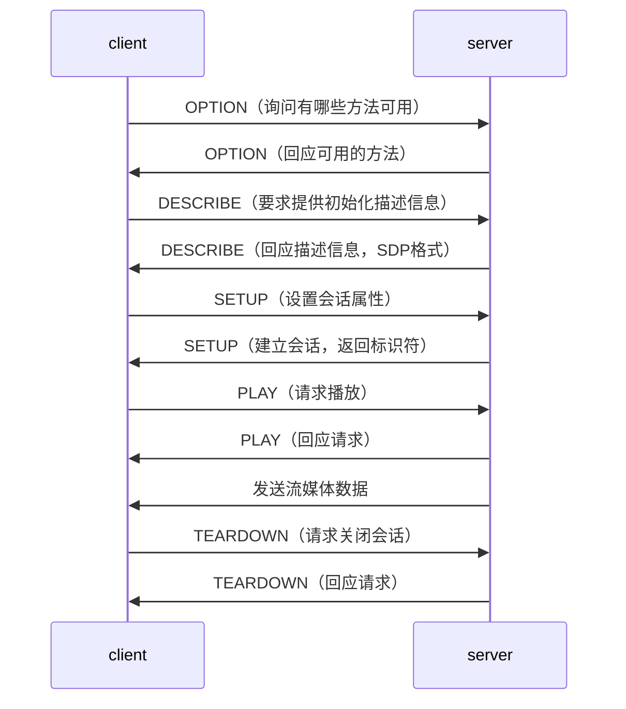
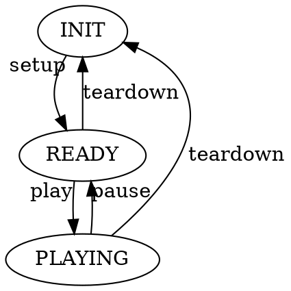

# 流媒体

[TOC]


## 总体

* 包含三个协议：RTP, RTCP, RTSP
* RTP：实时传输协议，用于传输流媒体数据
* RTCP：实时传输控制协议，用于对RTP进行控制、同步
* RTSP：实时流协议，用于发起/终结流媒体


## RTSP

### 概述
* 应用层、纯文本、待状态协议
* 默认端口为554，默认承载协议为TCP


### 交互


### 格式

#### 请求消息
```
方法 URL 版本号  CR LF
消息头 CR LF
消息体 CR LF
```


#### 回应消息
```
版本号 状态 CR LF
消息头 CR LF
消息体 CR LF
```

### 举例

```
C -> S
OPTION rtsp://<ipaddr>/xxx RTSP/1.0
CSeq: 1
User-Agent: VLC media player

S -> C
RTSP/1.0 200 OK
Server: UServer 0.9.7
CSeq: 1
Public: OPTION,SETUP,PLAY,PAUSE

C -> S
DESCRIBE rtsp://<ipaddr>/xxx RTSP/1.0
CSeq: 2
Accept: application/sdp
User-Agent: VLC media player

S -> C
RTSP/1.0 200 OK
Server: UServer 0.9.7
CSeq: 2
Last-Modified: xxx
Expires: xxx
Content-Length: xxx
Content-Type: application/sdp
<SDP数据>

C -> S
SETUP rtsp://<ipaddr>/xxx/trackID=xxx RTSP/1.0
CSeq: 3
Transport: RTP/AVP/TCP;unicast;xxx
User-Agent: VLC media player

S -> C
RTSP/1.0 200 OK
Server: UServer 0.9.7
CSeq: 3
Session: xxx
Cache-Control: no-cache
Transport: xxx
```


### 状态转换



## RTP

### 概述
* 数据包由 头部 和 负载 组成


### 头部
```
V | P | X | CC | M | PT | 序列号
            时间戳
            SSRC (同步信源)
            CSRC (特约信源)
```

### 负载
* 音频数据
* 视频数据


## RTCP

### 概述
* 提供流量控制，拥塞控制
* 采用多播方式发送数据包

### 数据包
* `SR` 发送端报告
* `RR` 接收端报告
* `SDES` 源描述
* `BYE`  通知离开