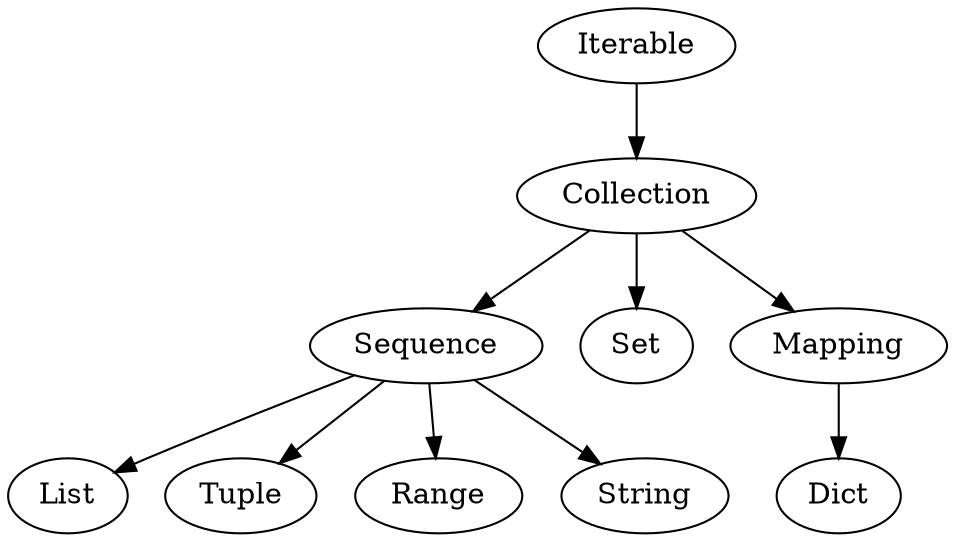

# Python3

[TOC]

## 说明
* `<xxx>` 表示类型
* `[xxx]` 表示可选

## 集合

### 类层次



### 内建函数
* `<int> = len(<col>)`  获取序列长度
* `<int> = sum(<iter>, [init])`  计算序列和
* `<el> = max(<iter>, [key])`  返回序列中的最大元素   
* `<el> = min(<iter>, [key])`  返回序列中的最小元素   
* `<iter> = reversed(<seq>)`    反转序列
* `<list> = sorted(<iter>, [key], [reverse_flag])` 排序序列
* `<enumerate> = enumerate(<inter>)`  每个元素是都都是(index, item)格式
* `<iter of tuple> = zip(<iter> ...)`  将多个序列对象打包成一个个元组

#### 示例
```python
sum([1, 2, 3], 2)
>>> 8

max([456, 700, 200])
>>> 700

list(enumerate(['Spring', 'Summer', 'Fall', 'Winter']))
>>> [(0, 'Spring'), (1, 'Summer'), (2, 'Fall'), (3, 'Winter')]

list(zip([1, 2, 3], [4, 5, 6]))
>>> [(1,4), (2,5), (3,6)]
```


### Sequence
* `x in <seq>`  判断是否在序列中
* `x not in <seq>` 判断是否不在序列中
* `<seq> = <seq>[from_inclusive : to_exclusive : step_size]` 切片操作

* `<seq>.append(<el>)` or `<seq> += <el>`  向尾部添加元素
* `<seq>.extend(<seeq>)` or `<seq> += <seq>`  向尾部添加子序列
* `<seq>.insert(index, <el>)` 向指定索引处插入元素
* `<el> = <seq>.pop([index])` 返回并移除指定索引处的元素，默认为尾部

* `<seq>.clear()`  清除序列数据
* `<seq>.reverse()` 原地反转序列


### List
* `<list> = []` or `<list> = list()` 定义空列表
* `<list> = [<el_1>, <el_2>, <el_3>]` 定义列表
* `<list> = list(<iter>)`   包装成列表
* `<list> = [expr for iter_val in <iter>]` 列表解析


#### 示例
```python
[ i * 2 for i in [8, -2, 5]]
>>> [16, -4, 10]

[ i for i in range(8) if i % 2 == 0] 
>>> [0, 2, 4, 6]
```


### Tuple
* `<tuple> = ()` 定义空元组， 元组是不可变类型
* `<tuple> = (<el_1>, <el_2>, <el_3>)` 定义元组
* `<tuple> = tuple(<iter>)`   包装成元组


### Range
* `<range> = range(to_exclusive)` 创建
* `<range> = range(from_inclusive, to_exclusive, [step_size]` 创建
* `from_inclusive = <range>.start` 
* `to_exclusive = <range>.stop`


### Set
* `<set> = set()` 
* `<set> = set(<iter>)` 

* `<set>.add(<el>)`        加入元素
* `<set> |= <el>`          加入元素
* `<set>.remove(<el>)`     移除元素,不存在会抛出异常
* `<set>.discard(<el>)`    移除元素,不存在则忽略 
* `<set>.update(<col>, ...)` 加入新集合
* `<set> |= <set>`           加入新集合
* `<el> = <set>.pop()`       返回并移除任意一个元素，若为空则抛出异常

* `<set> = <set>.union(<set>)` 取并集 
* `<set> = <set> | <set>`      取并集
* `<set> = <set>.intersection(<set>)` 取交集 
* `<set> = <set> & <set>`             取交集
* `<set> = <set>.difference(<set>)`   取差集
* `<set> = <set> - <set>`             取差集
* `<set> = <set>.symmetric_difference(<set>)`   取对称差集
* `<set> = <set> ^ <set>`                       取对称差集

#### 示例
```python
[1,2,3,4] | [3,4,5,6]
>>> [1,2,3,4,5,6]

[1,2,3,4] & [3,4,5,6]
>>> [3,4]

[1,2,3,4] - [3,4,5,6]
>>> [1,2]

[1,2,3,4] - [3,4,5,6]
>>> [1,2,5,6]
```


### Dict
* `<dict> = {}`
* `<dict> = {key_1 : val_1, key_2 : val_2}`
* `<dict> = dict(<iter>)`
* `<dict> = dict(zip(keys, values))`

* `<dict>[key] = value`  更新、添加条目
* `val = <diect>[key]`   获取条目值，不存在则抛出异常
* `del <dict>[key]`      删除条目

* `<dict>.clear()`       清除所有条目
* `val = <dict>.get(key, default)` 获取条目值，不存在则返回默认值
* `bool = <dict>.has_key(key)`     判断条目是否存在
* `<dict>.update(<dict>)`          用其他字典更新条目，如果已存在会覆盖

* `<view> = <dict>.keys()`   返回键视图，包含所有的键
* `<view> = <dict>.values()` 返回值视图，包含所有的值
* `<view> = <dict>.items()`  返回条目视图，包含键-值元组


## 类型

### 格式化
* `<str> = f"xxx {<el_1>}, {<el_2>}"` 
* `<str> = "xxx {}, {}".format(<el_1>, <el_2>)`

#### 示例
```python
name = 'Eric'
age = 74
"hello {}, You are {}".format(name, age)

name = 'Eric'
age = 74
f"hello {name}, You are {arg}
```


### String
* `<str> = <str>.strip()`  去除两边的空格

* `<list> = <str>.split()`  使用空格拆分字符串
* `<list> = <str>.split(sep)` 使用指定字符拆分字符串
* `<str> = <str>.join(<iter>)` 使用指定分隔符合并字符串序列

* `<bool> = <str>.startswith(<sub_str>)` 字符串头部是否包含指定字符串
* `<bool> = <str>.endswith(<sub_str>, [start], [end])` 字符串尾部是否包含指定字符串
* `<int> = <str>.index(<sub_str>)` 查找子字符串返回首次匹配的位置，不存在会抛出异常
* `<int> = <str>.find(<sub_str>)` 查找子字符串返回首次匹配的位置，不存在返回-1

* `<str> = <str>.replace(old, new)` 使用new字符串替换old字符串


## 语法

### 导入
* `import <module>`    导入模块
* `from <module> import name_1, name_2`  导入模块的指定部分
* `from <module> import *`  导入模块的所有内容
* `import <module> as var_name`  导入模板绑定到局部变量
* `from module import name as var_name` 导入模板指定部分并绑定到局部变量


#### 示例
```python
import Phone.Mobile.Analog

from Phone import Mobile
from Phone.Mobile import Analog

from .Analog import dial
from ..common_util import setup
from ..Fax import G3.dial
```

### 异常
