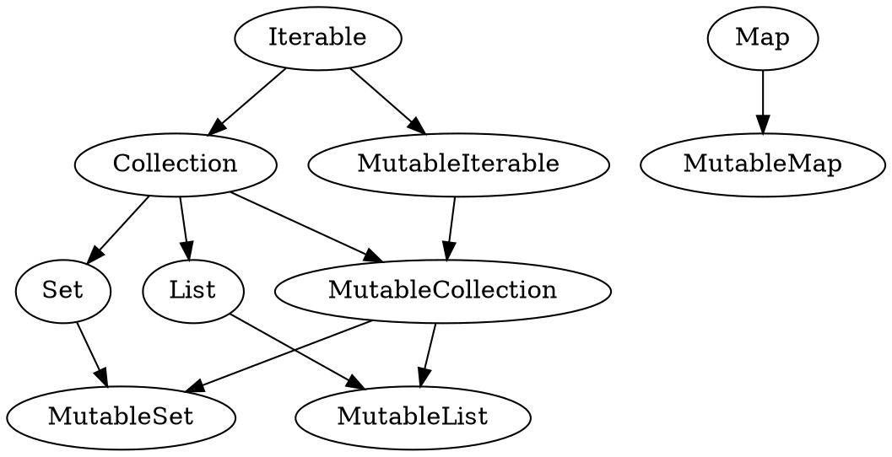

# Kotlin语法

[TOC]

## 基础

### 概述
* 一切都是对象
* `var` 定义可变的变量
* `val` 定义不可变的变量
* `===` 判断引用相等
* `==`  判断内容相等，使用`equals()`检测
* `if (<condition>) <result> else <result>` 三元表达式


### lambda表达式
* 被大括号包含，参数在`->`之前，函数体在`->`之后
* `it`为单个参数的隐式名字，不需要声明
* `_`用于未使用参数的声明
* 声明格式：`(<type>, <type>) -> <return-type>`
* 对于Java中的SAM接口，调用时可以使用lambda

#### 示例
```kotlin
{x: Int, y: Int -> x + y}

listOf(1, 2, 3).map { it * 2}

map.forEach { _, value -> println("$value!") }

//声明
(Int, Int) -> Unit

//Java 方法
void postponeComputation(int delay, Runnable computation);
//Kotlin中调用
postponeComputation(1000) { println(42) }

```

### 函数

#### 参数
* 使用`name:type`格式定义
* 可以定义默认值
* 调用传参时，可以指定参数名
* 若最后一个参数是lambda，则可以在括号外传入
* 可变数量参数，用`vararg`标记

##### 示例
```kotlin
fun foo(bar: Int, baz:Int = 1, qux: () -> Unit) { ... }

foo(1) { println("hello") }
foot(bar = 1, baz = 2, qux = { println("hello") })
```

#### 类型
```kotlin
//高阶函数：以其他函数作为参数、返回值的函数
fun foo(x: Int) {
	//局部函数：在一个函数内部定义的函数
	fun double(y: Int): Int {
		return y * 2
	}
	println(double(x))
}

//扩展函数：在不修改已有类的前提下，给其增加新方法
fun View.invisible() {
	this.visibility = View.INVISIBLE
}

//单表达式函数，使用` = `符号定义代码体
fun double(x: Int): Int = x * 2

//中缀表达函数
infix fun Int.shl(x: Int): Int { ... }

1 shl 2 
1.shl(2)


//内嵌函数
inline fun idouble(s: Int): Int { ... }
```

### 标签
* `<name>@` 定义标签，任何表达式都可以定义
* `break@<name>` 结束标签指定的循环
* `continue@<name>`  跳转到标签指定循环的下一次
* `return@<name>`   从标签指定的位置返回

#### 实例
```kotlin
fun foo() {
    listOf(1, 2, 3, 4, 5).forEach lit@{
        if (it == 3) return@lit 
        print(it)
    }
    print(" done with explicit label")
}

fun foo() {
    listOf(1, 2, 3, 4, 5).forEach {
        if (it == 3) return@forEach
        print(it)
    }
    print(" done with explicit label")
}
```


## 类型


### 数字
* 整型：`Byte`（8位）, `Short`（16位）, `Int`（32位）, `Long`（64位）
* 浮点：`Float`, `Double`
* 无符号整型：`UByte`, `UShort`, `UInt`, `ULong`

#### 定义
* `123`         十进制
* `0x0F`        十六进制
* `0b00001011`  二进制
* `123L`        Long型
* `125.5F`      Float型
* `123u`        无符号类型
* `123ul`       无符号长整型


### 字符串
* `"xxxx"`    定义可转义字符串
* `"""xxx"""` 定义原生字符串，不会进行转义处理
* `${xxx}`    模板求值

#### 示例
```kotlin
println("Hello, $name")
println("Hello, ${if (args.size > 0) args[0] else "someone"}!")

val html = """
	<html>
		<body>
			<p>Hello Word</p>
		</body>
	</html>
"""
```

### 数组
* `arrayOf(<val_1>, <val_2>,...)` 创建Array类型数组
* `arrayOfNulls(<size>)`  创建Array类型的空数组
* `intArrayOf(<val_1>, <val_2>, ...)` 创建IntArray原生类型数组


## 集合

### 概述
* 分成 可变集合(Mutable) 和 不可变集合(Immutable)
* 类型有：list, set, map
* 可以使用序列进行惰性求值


### 类层次



### List

#### 创建
* 创建不可变空列表 `<list> = emptyList()`
* 创建不可变列表 `<list> = listOf('a', 'b', 'c')`
* 创建可变空列表 `<list> = mutableListOf<Type>()`
* 创建可变列表 `<list> = mutableListOf(1, 2, 3)`

#### 获取元素
* 获取指定位置元素 `<elm> = <list>.get(index)` or `<elm> = <list>[index]`
* 获取第一个元素 `<elm> = <list>.first()`
* 获取最后一个元素 `<elm> = <list>.last()`
* 获取首个满足条件的元素 `<elm> = <list>.first { it -> <cond> }`
* 获取最后一个满足条件的元素 `<elm> = <list>.last { it -> <cond> }`

* 使用区间获取元素 `<list> = <list>.slice(<range>)`
* 从头获取指定数量的元素 `<list> = <list>.take(num)`
* 从头去除指定数据的元素 `<list> = <list>.drop(num)`
* 从头获取匹配条件的元素 `<list> = <list>.takeWhile { it -> <cond> }`
* 从尾获取指定数量的元素 `<list> = <list>.takeLast(num)`
* 从尾去除指定数据的元素 `<list> = <list>.dropLast(num)`
* 从尾获取匹配条件的元素 `<list> = <list>.takeLastWhile { it -> <cond> }`

#### 更新元素
* 向尾部插入元素 `<bool> = <list>.add(<elm>)`
* 向指定位置插入元素 `<bool> = <list>.add(index, <elm>)`
* 向尾部插入列表 `<bool> = <list>.add(<new-list>)`
* 向指定位置插入列表 `<bool> = <list>.add(index, <new-list>)`
* 向指定位置替换元素 `<list>.set(index, <elm>)` or `<list>[index] = <elm>`


#### 查找
* 从头线性查找，返回指定元素的索引，无返回 -1 `index = <list>.indexOf(<elm>)`
* 从尾线性查找，返回指定元素的索引，无返回 -1 `index = <list>.lastIndexOf(<elm>)`
* 从头线性查找，返回匹配元素的索引，无返回 -1 `index = <list>.indexOfFirst { elm -> <cond> }`
* 从尾线性查找，返回匹配元素的索引，无返回 -1 `index = <list>.indexOfLast { elm -> <cond> }`

#### 转换、过滤
* 映射 `<list> = <list>.map { elm -> <oper> }`
* 带索引的映射 `<list> = <list>.mapIndexed { idx, value -> <oper> }`
* 带null值过滤的映射 `<list> = <list>.mapNotNull { elm -> <oper> }`

* 肯定条件过滤 `<list> = <list>.filter { elm -> <cond> }`
* 否定条件过滤 `<list> = <list>.filterNot { elm -> <cond> }`
* 过滤给定类型 `<list> = <list>.filterIsInstance<Type>()`

#### 排序-返回新列表
* 自然升序排序 `<list> = <list>.sorted()`
* 自然降序排序 `<list> = <list>.sortedDescending()`
* 获取倒序 `<list> = <list>.reversed()`
* 随机排序 `<list> = <list>.shuffled()`
* 自定义排序 `<list> = <list>.sortedBy { elm -> <oper> }`

#### 排序-修改旧列表
* 自然升序排序 `<list>.sort()`
* 自然降序排序 `<list>.sortDescending()`
* 获取倒序 `<list>.reverse()`
* 随机排序 `<list>.shuffle()`
* 自定义排序 `<list>.sortBy { elm -> <oper> }`


#### 集合操作
* 求交集  `<list> = <list>.intersect(<list>)`
* 求并集  `<list> = <list>.union(<list>)`
* 求差集  `<list> = <listA>.subtrace(<listB>)` 
    * 存在于A中，不存在于B中


#### 分组、分块
* 将列表分块 `<nest-list> = <list>.chunked(size)`
* 将列表分块并转换 `<list> = <list>.chunked(size) { elm -> <oper> }`
* 将元素按条件分组 `<map:key-list> = <list>.groupBy { elm -> <cond> }`

#### 扁平化
* 将嵌套列表合并成一个列表 `<list> = <nest-list>.flatten()`
* 先映射元素后进行合并 `<list> = <nest-list>.flatMap { elm -> <oper> }`
	* 等同于 `<list> = <nest-list>.map().flatten()`

#### 聚合
* 将操作应用于元素并累积 `result = <list>.fold(init, { acc, elm -> <oper> })`
	* 可以提供一个初始值
* 将操作应用于元素并累积 `result = <list>.reduct { acc, elm -> <oper> }`
	* 将第一个元素作为初始值，该元素不会被应用操作

#### 转换为字符串
* 将列表元素合并成一个字符串 `<str> = <list>.joinToString([separator], [prefix], [postfix])`
* 将列表元素合并加入`Appendable`对象中 `<list>.joinTo(<appendable>, [separator], [prefix], [postfix])`

#### 其他
* 将元素求和  `<list>.sumBy{ elm.<field> }`
* 惰性求值 `<list>.asSequence().xxx.toList()`

#### 示例
```kotlin
val list = mutableListOf(1, 2, 3)
var result = list.map { it * 3 }
result = list.mapIndexed { idx, value -> value * idx }

result = list.mapNotNull { if ( it == 2) null else it * 3 }
result = list.mapIndexedNotNull { idx, value -> 
				if (idx == 0) null else value * idx 
			}

list.asSequence()
	.filter {it > 2}.map {it * 2}
	.toList()
//[6]


val numbers = (0..13).toList()
numbers.chunked(3)
//[[0, 1, 2], [3, 4, 5], [6, 7, 8], [9, 10, 11], [12, 13]]

numbers.chunked(3) { it.sum() }
//[3, 12, 21, 30, 25]

val numbers = listOf("one", "two", "three", "four", "five", "six")
numbers.first { it.length > 3 }

//three
numbers.last { it.startsWith("f") }
//five


val numbers = listOf("one", "two", "three", "four", "five")
numbers.groupBy { it.first().toUpperCase() }
//{O=[one], T=[two, three], F=[four, five]}

numbers.groupBy(keySelector = { it.first() }, valueTransform = { it.toUpperCase() })
//{o=[ONE], t=[TWO, THREE], f=[FOUR, FIVE]}


val numbers = listOf(5, 2, 10, 4)
numbers.fold(0) { sum, element -> sum + element * 2 }
//42


val numberSets = listOf(setOf(1, 2, 3), setOf(4, 5, 6), setOf(1, 2))
numberSets.flatten()
//[1, 2, 3, 4, 5, 6, 1, 2]


val numbers = listOf("one", "two", "three", "four")
numbers.joinToString()
//one, two, three, four

val numbers = listOf("one", "two", "three", "four")    
numbers.joinToString(separator = " | ", prefix = "start: ", postfix = ": end")
//start: one | two | three | four: end
```


### Map


#### 创建
* 创建不可变空map `<map> = mapOf<KeyType, ValType>()`
* 用二元组创建不可变map `<map> = mapOf(<pair>)`
* 创建可变空map `<map> = mutableMapOf<KeyType, ValType>()`

#### 获取值
* 获取值 `<value> = <map>.get(<key>)`
* 获取值，或默认值 `<value> = <map>.getOrDefault(<key>, { <def-value> })`
* 获取值，或加入默认值  `<value> = <map>.getOrPut(<key>, { <def-value> })`
* 隐式默认值 `<map>.withDefault { <def-value> }` 
    * 需要使用`getValue`方法才有效


#### 示例
```kotlin
val config = HashMap<String, Boolean>()

val isEnabled = config.getOrElse("isEnabled", { false })
```


### Range

#### 创建
* 创建闭区间 `<int>..<int>` 或 `<int>.rangeTo(<int>)`
* 创建半闭区间 `<int> until <int>`
* 创建递减区间 `<int>.downTo(<int>)`

#### 其他
* 定义间隔 `<range>.step(<int>)`

#### 示例
```kotlin
1..1024  // [1,1024]
1 until 1024 // [1,1024)

1..10.step(2) // 1, 3, 5, 7, 9

```


## 类型系统

### 可空
* 定义可空类型 `<type>?`
    * Int? = Int or null
* 安全调用 `?.`
    * 当非空时才会进行调用
* 断言调用 `!!.`
    * 当空时会抛出异常
* Elvis操作符 `?: <default>`
    * 当空时返回默认值

#### 示例
```kotlin
na?.length  //返回null
na!!.length // 返回KotlinNullPointerException

y = x?:0  //等价于下面语句
val y = if(x !== null) x else 0  
```

### 转换
* 使用`is`后，编译器会自动进行类型转换
* `as`操作符，当对象为空则抛出异常
* `as?`操作符，当对象为空则返回null

#### 示例
```kotlin
val stu: Any = Student(Glasses(189))
if(stu is Student) println(stu.glasses)

var stu: Student? = getStu() as Student?
```


## 面向对象

### 概述
* 类成员默认是全局可见的
* 类默认是final的，不可继承
* 构建对象时，不需要new关键字
* 一个文件中可以创建多个类


### 构造函数
* 主构造函数，如果没有定义任何构造函数，系统会生成一个空构造函数
	```kotlin
	class Person constructor(firstName: String) { /*...*/ }
	
	//若无任何标注和可见性修改器，则可以省略constructor
	class Person(firstName: String) { /*...*/ }

	//定义属性
	class Person(
		val firstName: String,
		val lastName: String,
		var age: Int, // trailing comma
	) { /*...*/ }

	//屏蔽掉公开的构造函数
	class DontCreateMe private constructor () { /*...*/ }
	```
* `init`关键字用于定义初始化代码
	```kotlin
	class InitOrderDemo(name: String) {
		val firstProperty = "First property: $name".also(::println)
		
		init {
			println("First initializer block that prints ${name}")
		}
		
		val secondProperty = "Second property: ${name.length}".also(::println)
		
		init {
			println("Second initializer block that prints ${name.length}")
		}
	}
	```
* 次构造函数
	```kotlin

	//需要constructor做前缀
	class Pet {
    	constructor(owner: Person) { }
	}

	//次构造函数需要委托给主构造函数
	class Person(val name: String) {
		constructor(name: String, parent: Person) : this(name) { }
	}
	```

### 继承
* 构造函数
```kotlin
open class Base(p: Int)
class Derived(p: Int) : Base(p)

//次构造函数，需要使用super
class MyView : View {
    constructor(ctx: Context) : super(ctx)
    constructor(ctx: Context, attrs: AttributeSet) : super(ctx, attrs)
}
```
* 覆盖方法
```kotlin
open class Shape {
    open fun draw() { /*……*/ }
    fun fill() { /*……*/ }
}

class Circle() : Shape() {
    override fun draw() { /*……*/ }
}
```
* 调用超类实现
```kotlin
open class Rectangle {
    open fun draw() { println("Drawing a rectangle") }
    val borderColor: String get() = "black"
}

class FilledRectangle : Rectangle() {
    override fun draw() {
        super.draw()
        println("Filling the rectangle")
    }

    val fillColor: String get() = super.borderColor
}
```

### 属性
* 声明语法
```
var <propertyName>[: <PropertyType>] [= <property_initializer>]
    [<getter>]
    [<setter>]
```
* 只读属性
```kotlin
val isEmpty: Boolean
    get() = this.size == 0
```
* 读写属性
```kotlin
var stringRepresentation: String
    get() = this.toString()
    set(value) {
        setDataFromString(value)
    }
```
* 延时初始化 `by lazy`
    * 只能用于val变量
    * 首次调用时，才会进行赋值操作
    * 系统会加上同步锁，是线程安全的
```kotlin
class Bird(val weight: Double = 0.00,
		   val age: Int = 0, val color: String = "blue") { 
    val sex: String by lazy { 
		if (color == "yellow") "male" else "female"
	}
}
```
* 延时初始化 `lateinit`
    * 只能用于var变量
    * 不能用于基本数据类型
```kotlin
class Bird(val weight: Double = 0.00,
		   val age: Int = 0, val color: String = "blue") { 
    lateinit var sex: String

    fun printSex() { 
		this.sex = if (this.color == "yellow") "male" else "female"
		println(this.sex)
	}
}
```


### 伴生对象
* 伴随某个类的对象，属于该类
* 全局只有一个实例
* 在类被装载时会被初始化
```kotlin
class Prize(...) {
	companion object {
		fun isRedpack(prize: Prize): Boolean {}
	}
}

//实现工厂模式
class Prize private constructor(...) {
	companion object {
		fun newRedpackPrize(...) = Prize(...)
	}
}
```


### 创建单例类
* 使用object实现
* 可以实现接口，可以继承类
```kotlin
object DatabaseConfig {
	var host: String = "localhost"
	var port: Int = 5000
}
```

### 生成匿名内部类
```kotlin
val comparator = object : Comparator<String> { 
	override fun compare(s1: String?, s2: String?): Int { ... }
}
```


## 扩展

### 内置函数
* `with`
    ```kotlin
    with(bean) {
        //直接调用bean的方法、属性
        //返回值为最后一行
		titleTV.text = title 
	}
    ```
* `let`
    ```kotlin
    bean.let {
        //it表示bean
        //返回值为最后一行
        it.title   
    }
    bean?.let {  //统一进行判空处理
        it.function()  
    }
    ```
* `also`
    ```kotlin
    bean.also {
        //it表示bean
        //返回值为bean对象
        it.title 
    }
    ```
* `run` 
    ```kotlin
    bean.run {
        //直接调用bean的方法、属性
        //返回值为最后一行
        titleTV.text = title 
    }
    bean?.run { ... }
    ```
* `apply` 
    ```kotlin
    bean.apply { 
        //直接调用bean的方法、属性
        //返回值为bean对象
        titleTV.text = title 
    }
    bean?.apply { ... }
    ```

## 协程

### 概念
* suspend 修饰一个函数，使其成为挂起函数，可以运行在协程中
* CoroutineContext 上下文，用于记录协程的运行环境
	* 包括：Job，CoroutineDispatcher
* CoroutineDispatcher 调度器，确定协程运行的线程
* CoroutineScope  作用域，用于管理协程
* Job 协程本身，用于控制协程


### 操作

#### 启动 - 非协程环境
* `runBlocking { ... }`   启动协程，阻塞当前线程
* `GlobalScope.launch { ... }`  启动全局协程
* `CoroutineScope + launch { ... }`  在作用范围中启动协程

#### 启动 - 协程中
* `<Job> = launch { ... }`       启动无返回值的协程
* `<Deferred> = async { ... }`   启动有返回值的协程
* `<Val> = withContext(<CoroutineContext>) { ... }`  在特定的上下文中启动协程


#### 取消
* `<Job>.cancel()`         取消协程
* `<Job>.cancelAndJoin()`  取消协程并等待结束


#### 等待
* `<Job>.join()`           等待协程完成
* `<Deferred>.await()`     等待并获取协程结果

#### 超时
* `withTimeout(ms) { ... }`  协程运行超时后会抛出异常
* `withTimeoutOrNull(ms) { ... }` 协程运行超时后返回null

#### 其他
* `delay(ms)`     延时操作，会挂起协程
* `yield()`          放弃运行，会挂起协程


#### 示例
```kotlin
fun main() = runBlocking { // this: CoroutineScope 
    launch { // 启动一个新的协程，并继续运行
        delay(1000L) // 非阻塞的延时1秒
        println("World!") // 延时后打印 
    }
    println("Hello") // 当前一个协程被延迟时，主协程会继续运行
}

>>> Hello
>>> World!
```

### 作用域
* `coroutineScope { ... }`  创建一个作用域，其中的协程是并行运行

#### 示例
```kotlin
suspend fun doWorld() = coroutineScope { // this: CoroutineScope
    launch {
        delay(2000L)
        println("World 2")
    }
    launch {
        delay(1000L)
        println("World 1")
    }
    println("Hello")
}
```

### 异步流(Flow)
* 作用：使挂起函数可以返回多个异步结果值
* 流是冷的：直到流中数据被收集时，构建器中的代码才会被执行

#### 操作
* `flow { ... }` 流构建器
* `asFlow()`     将集合、序列转换成流
* `emit(<val>)`  向流发送值
* `collect`      从流中收集值


#### 示例
```kotlin
fun simple(): Flow<Int> = flow { // 数据流构建器
    for (i in 1..3) {
        delay(100) 
        emit(i) // 发射值
    }
}

fun main() = runBlocking<Unit> {

    // 收取(collect)流中的内容
    simple().collect { value -> println(value) }

}
```


### 通道(Channel)
* 作用：在多个协程之间传输数据，类似于BlockingQueue

#### 操作
* `Channel<T>(<buf-size>)`  创建通道
* `<channel> = ticker()`    创建定时器通道
* `send()` 发送数据，会挂起协程
* `receive()` 接收数据，会挂起协程
* `close()`  关闭通道
* `for (<val> in <channel>) { ... }` 遍历通道


#### 示例
```kotlin
val channel = Channel<Int>()
launch {
    for (x in 1..5) channel.send(x * x)
    channel.close() //关闭通道
}

//通道被关闭后循环就会结束
for (y in channel) println(y)
println("Done!")
```


### Actor
* 构成：一个协程 + 一个状态值 + 一个通道


#### 操作
* `actor<T>()` 创建一个Actor


#### 示例
```kotlin
//定义消息
sealed class CounterMsg
object IncCounter : CounterMsg() // 单向消息
class GetCounter(val response: CompletableDeferred<Int>) : CounterMsg() // 带响应的消息

//定义Actor
fun CoroutineScope.counterActor() = actor<CounterMsg> {
    var counter = 0 //状态值
    for (msg in channel) {  
        when (msg) {
            is IncCounter -> counter++
            is GetCounter -> msg.response.complete(counter)
        }
    }
}

//使用
fun main() = runBlocking<Unit> {
    val counter = counterActor() // 创建actor
    withContext(Dispatchers.Default) {
        massiveRun {
            counter.send(IncCounter)
        }
    }

    //发送一个消息, 从actor得到响应
    val response = CompletableDeferred<Int>()
    counter.send(GetCounter(response))
    println("Counter = ${response.await()}")

    counter.close() // 关闭actor
}

```