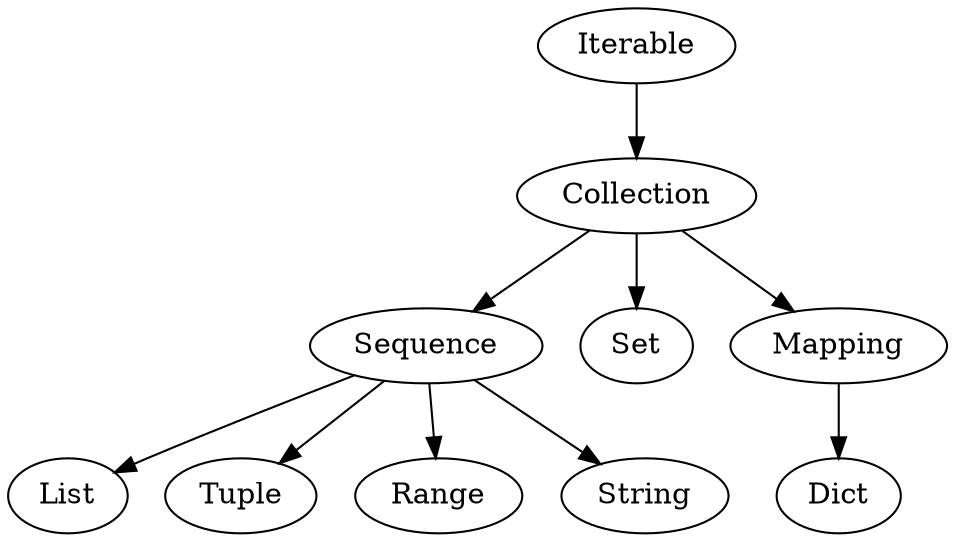

# Python3语法

[TOC]

## 说明
* `<xxx>` 表示类型
* `[xxx]` 表示可选


## 基础
* `X if C else Y` 三元操作符
* `with context_expr [as var]` 用于简化资源的分配和释放
* `if C is not None`  是否不是空值
* `if C is None`  是否是空值
* `global <var>`  标识为全局变量
* `nonlocal <var>`  标识为上一级函数中的局部变量
* 函数参数的默认值是一个全局对象
* `*args` 可变参数,是一个元组
* `**kwargs` 可变参数，是一个字典

### 示例
```python
smaller = x if x  < y else y

with open('/etc/passwd', 'r') as f:
    for eachLine in f:
        #...


gStatus = 'xxx'

def testOne() :
    global gStatus
    gStatus = 'yyy'

    lStatus = 'xxx'

    def testTwo() :
        nonlocal lStatus

        lStatus = 'yyy'


#如果使用默认值，infos会指向一个全局数组
def xxx(infos: List[str] = []) :
    pass


def test_arg(*args):
    print(args)

test_arg(1,2,3)    #(1,2,3)
test_arg(*(1,2,3)) #(1,2,3)

def test_kwargs(**kwargs):
    print(kwargs)

test_kwargs(y=2, z=3)  #{'y':2, 'z':3}
test_kwargs(**{'y':2, 'z':3}) #{'y':2, 'z':3}
```

## 集合

### 类层次



### 内建函数
* `<int> = len(<col>)`           获取序列长度
* `<int> = sum(<iter>, [init])`  计算序列和
* `<el> = max(<iter>, [key])`    返回序列中的最大元素   
* `<el> = min(<iter>, [key])`    返回序列中的最小元素   
* `<iter> = reversed(<seq>)`     反转序列
* `<list> = sorted(<iter>, [key], [reverse_flag])` 排序序列

* `<enumerate> = enumerate(<iter>)`    每个元素是都都是(index, item)格式
* `<iter of tuple> = zip(<iter> ...)`  将多个序列对象打包成一个个元组

* `<iter> = filter(<func>, <iter>)`    过滤一个序列
   * `<func> : <bool> = func(<item>)`  函数原型
* `<iter> = map(<func>, <iter_1>, <iter_2>, ...)`       过滤多个序列
   * `<func> :  <item> = func(<item_1>, <item_2>, ...)` 函数原型

* `value = reduce(<func>, <iter>, init_value)`   合并序列，该函数位于functools包中
   * `<func> : value = func(last_value, <item>)` 函数原型


#### 示例
```python
sum([1, 2, 3], 2)
>>> 8

max([456, 700, 200])
>>> 700

list(enumerate(['Spring', 'Summer', 'Fall', 'Winter']))
>>> [(0, 'Spring'), (1, 'Summer'), (2, 'Fall'), (3, 'Winter')]

list(zip([1, 2, 3], [4, 5, 6]))
>>> [(1,4), (2,5), (3,6)]


list(filter(lambda n: n%2, [1, 2, 3, 4]))
>>> [1, 3]

list(map(lambda x, y: x + y, [1,3,5], [2,4,6]))
>>> [3, 7, 11]

reduce(lambda x,y: x + y, [0,1,2,3,4], 0)
>>> 10
```


### Sequence
* `x in <seq>`  判断是否在序列中
* `x not in <seq>` 判断是否不在序列中
* `<seq> = <seq>[from_inclusive : to_exclusive : step_size]` 切片操作

* `<seq>.append(<el>)` or `<seq> += <el>`  向尾部添加元素
* `<seq>.extend(<seeq>)` or `<seq> += <seq>`  向尾部添加子序列
* `<seq>.insert(index, <el>)` 向指定索引处插入元素
* `<el> = <seq>.pop([index])` 返回并移除指定索引处的元素，默认为尾部

* `<seq>.clear()`  清除序列数据
* `<seq>.reverse()` 原地反转序列


### List
* `<list> = []` or `<list> = list()` 定义空列表
* `<list> = [<el_1>, <el_2>, <el_3>]` 定义列表
* `<list> = list(<iter>)`   包装成列表
* `<list> = [expr for iter_val in <iter>]` 列表解析
* `for index, val in enumerate(<list>)`  带索引的循环
* `<index = <list>.index(<val>) if <val> in <list> else -1`  模拟find方法


#### 示例
```python
[ i * 2 for i in [8, -2, 5]]
>>> [16, -4, 10]

[ i for i in range(8) if i % 2 == 0] 
>>> [0, 2, 4, 6]

for index, val in enumerate(['one', 'two']) :
    print(f"{index} : {val}")
>>> 0 : one
>>> 1 : two
```


### Tuple
* `<tuple> = ()` 定义空元组， 元组是不可变类型
* `<tuple> = (<el_1>, <el_2>, <el_3>)` 定义元组
* `<tuple> = tuple(<iter>)`   包装成元组


### Range
* `<range> = range(to_exclusive)` 创建
* `<range> = range(from_inclusive, to_exclusive, [step_size]` 创建
* `from_inclusive = <range>.start` 
* `to_exclusive = <range>.stop`


### Set
* `<set> = set()` 
* `<set> = set(<iter>)` 

* `<set>.add(<el>)`        加入元素
* `<set> |= <el>`          加入元素
* `<set>.remove(<el>)`     移除元素,不存在会抛出异常
* `<set>.discard(<el>)`    移除元素,不存在则忽略 
* `<set>.update(<col>, ...)` 加入新集合
* `<set> |= <set>`           加入新集合
* `<el> = <set>.pop()`       返回并移除任意一个元素，若为空则抛出异常

* `<set> = <set>.union(<set>)` 取并集 
* `<set> = <set> | <set>`      取并集
* `<set> = <set>.intersection(<set>)` 取交集 
* `<set> = <set> & <set>`             取交集
* `<set> = <set>.difference(<set>)`   取差集
* `<set> = <set> - <set>`             取差集
* `<set> = <set>.symmetric_difference(<set>)`   取对称差集
* `<set> = <set> ^ <set>`                       取对称差集

#### 示例
```python
[1,2,3,4] | [3,4,5,6]
>>> [1,2,3,4,5,6]

[1,2,3,4] & [3,4,5,6]
>>> [3,4]

[1,2,3,4] - [3,4,5,6]
>>> [1,2]

[1,2,3,4] - [3,4,5,6]
>>> [1,2,5,6]
```


### Dict
* `<dict> = {}`
* `<dict> = {key_1 : val_1, key_2 : val_2}`
* `<dict> = dict(<iter>)`
* `<dict> = dict(zip(keys, values))`

* `<dict>[key] = value`  更新、添加条目
* `val = <diect>[key]`   获取条目值，不存在则抛出异常
* `del <dict>[key]`      删除条目

* `<dict>.clear()`       清除所有条目
* `val = <dict>.get(key, default)` 获取条目值，不存在则返回默认值
* `key in <dict>`                  判断条目是否存在
* `key not in <dict>`              判断条目是否不存在
* `<dict>.update(<dict>)`          用其他字典更新条目，如果已存在会覆盖

* `<view> = <dict>.keys()`   返回键视图，包含所有的键
* `<view> = <dict>.values()` 返回值视图，包含所有的值
* `<view> = <dict>.items()`  返回条目视图，包含键-值元组（key,value）


## 类型相关


### 获取类型
* 任何事物都是一个对象
* 任何对象都有一个类型
* 类型和类是相同的

* `<type> = type(<el>)` 获取类型
* `<type> = <el>.class` 获取类型
* `<bool> = isinstance(<el>, <type>)`          判断是否是某类型实例，处理继承关系
* `<bool> = issubclass(type(<el>), <type>)`  判断是否是某类型实例

#### 示例
```python 
isinstance(2, int)
isinstance(2, (str, int, list))
```


### 格式化
* `<str> = f"xxx {<el_1>}, {<el_2>}"`            f-string语法
* `<str> = "xxx {}, {}".format(<el_1>, <el_2>)`  str.format()方法

#### 示例
```python
name = 'Eric'
age = 74
"hello {}, You are {}".format(name, age)

name = 'Eric'
age = 74
f"hello {name}, You are {arg}
```


### String
* 分为：普通类型（默认类型），字节流类型

* `<b-str> = <str>.encode(<type>)`  编码成字节流类型，机器可认
* `<str> = <b-str>.decode(<type>)`  解码成普通类型，人可认

* `<str> = <str>.strip()`  去除两边的空格

* `<list> = <str>.split()`  使用空格拆分字符串
* `<list> = <str>.split(sep)` 使用指定字符拆分字符串
* `<str> = <str>.join(<iter>)` 使用指定分隔符合并字符串序列

* `<bool> = <str>.startswith(<sub_str>)` 字符串头部是否包含指定字符串
* `<bool> = <str>.endswith(<sub_str>, [start], [end])` 字符串尾部是否包含指定字符串
* `<int> = <str>.index(<sub_str>)` 查找子字符串返回首次匹配的位置，不存在会抛出异常
* `<int> = <str>.find(<sub_str>)` 查找子字符串返回首次匹配的位置，不存在返回-1

* `<str> = <str>.replace(old, new)` 使用new字符串替换old字符串


### 整数
* `<int> = int(<int>)`  向下取整, 3.7 -> 3
* `<int> = math.ceil(<int>)`  向上取整，3.2 -> 4
* `<int> = round(<int>)`  四舍五入
* `(<int> , <int>) = math.modf(<int>)`  获取整数部分和小数部分


### namedtuple
* `<cls> = namedtuple(<cls_name>, [<field_name>, ...])`  创建命名元组
* `<obj> = <cls>(<val>, ...)` 创建对象
* `<obj> = <cls>(<field_name>=<val>)`  创建对象
* `<val> = <obj>.<field_name>`  获取属性

#### 示例
```python
Student = namedtuple("Student", ['name', 'gender', 'age', 'number'])

stu1 = Student('KK', 'M', 23, 2021)
age = stu1.age

stu2 = Student(name='KK', gender='M', age=23, number=2021)
```

### dataclass
* 定义数据类，自动生成`__init__`,`__repr__`,`__eq__`,`__hash__`
* `@dataclass(frozen=True)`   定义不可变的数据类
* `<field> = field(default_factory=list)`  定义空列表为默认值
* `<field>: InitVar[]`  该属性只用于初始化
* `def __post_init__(self)`  定义初始化回调函数
* `dataclasses.asdict()`  将实例转换为字典
* `dataclasses.astuple()`   将实例转换为元组


#### 示例
```python
@dataclass
class C:
    a: int
    b: int
    c: int = field(init=False)
    j: int = None
    mylist: List[int] = field(default_factory=list)

    database: InitVar[DatabaseType] = None
 
    def __post_init__(self):
        self.c = self.a + self.b
        self.j = database.lookup('j')
```


## 语法


### 导入
* `import <module>`    导入模块
* `from <module> import name_1, name_2`  导入模块的指定部分
* `from <module> import *`  导入模块的所有内容
* `import <module> as var_name`  导入模板绑定到局部变量
* `from module import name as var_name` 导入模板指定部分并绑定到局部变量


#### 示例
```python
import Phone.Mobile.Analog

from Phone import Mobile
from Phone.Mobile import Analog

from .Analog import dial
from ..common_util import setup
from ..Fax import G3.dial
```


### 类

#### 创建
```python
class Hello(object) :
    foo = 100             #类属性

    def __init__(self) :  #构造函数
        self.data = 1     #实例属性
        self.__pData = 1  #私有的实例属性

    def incData(self) :   #实例方法
        self.data = self.data + 1  

    @staticmethod
    def foo() :           #静态方法
        pass

    @classmethod    
    def foo(cls) :   #    类方法
        pass 
```

#### 继承
```python
class Person:
    def __init__(self, name, age):
        self.name = name
        self.age  = age

class Employee(Person):
    def __init__(self, name, age, staff_num):
        super().__init__(name, age)
        self.staff_num = staff_num
```

#### 属性
```python
class MyClass :


   @Property
   def a(self) :
      return self.__a

   @a.setter
   def a(self, value) :
      self.__a = value
      
```
```
>>> el = MyClass()
>>> el.a = 123
```


### lambda
* 用于创建匿名函数
* `lambda [arg_1, arg_2, ...]: <expression>` 定义语法
* 外部变量引用：闭包会记住变量的名称和作用范围，在需要时进行解析


#### 示例
```python
lambda x, y: x + y


a = lambda x, y=2: x + y
a(3)
a(3, 6)
```


### 装饰器

#### 定义

* 基于函数，不带参数
```python
def decorator(func):
    def wrapper(*args, **kwargs):
        return func(*args, **kwargs)
    return wrapper

@decorator
def function():
    print("hello, decorator")

# hello, decorator
```

* 基于函数，带参数
```python
def decorator(arg) :
    def outwrapper(func) :
        def wrapper(*args, **kwargs):
            return func(*args, **kwargs)

        return wrapper
    return outwrapper

@decorator(arg=xxx)
def function():
    print("hello, decorator")
```

* 基于类，不带参数
```python
class decorator(object) :

    def __init__(self, func) :
        self.func = func

    def __call__(self, *args, **kwargs) :
        return self.func(*args, **kwargs)


@decorator
def function():
    print("hello, decorator")
```


* 基于类，带参数
```python
class decorator(object) :

    def __init__(self, arg) :
        self.arg = arg

    def __call__(self, func) :
        def wrapper(*args, **kwargs):
            func(*args, **kwargs)
        return wrapper


@decorator
def function(arg=xxx):
    print("hello, decorator")
```


#### property

* `@property` 将函数标记为属性的读函数
* `@xxx.setter` 将函数标记为属性的写函数
* `@xxx.deleter` 将函数标记为属性的删除函数

##### 示例
```python
class Student(object):
    
    @property
    def age(self):
        return self._age

    @age.setter
    def age(self, value):
        self._age = value

    @age.deleter
    def age(self):
        del self._age


test = Student()

test.age = 25  # 设置属性
test.age  # 查询属性
del test.age  # 删除属性
```


### 异常

#### try-except
```python
try:
    <code>
except <exception> :
    <code>
except <exception> as <name> :
    <code>
except (exception_1, exception_2) :
    <code>
```

#### try-finally
```python
try:
    <code_for_normal>
except <exception_a>:
    <code_for_exception_a>
except <exception_b>:
    <code_for_exception_b>
else:
    <code_for_no_exception>
finally:
    <code_always>
```

#### Catching
* `except <exception> :`  
* `except <exception> as <name> :` 捕获异常并获取其实例
* `except (<exception>, [...]) :` 捕获多个异常
* `except (<exception>, [...]) as <name> :`

#### Raising
* `raise <exception>`
* `raise <exception>()`
* `raise <exception>(<el> [, ...])`

#### Built-in
* BaseException 所有异常的基类
* SystemExit   解释器请求退出
* Exception 常规错误的基类
* StopInteration 迭代器没有更多的值
* Warning 警告的基类


### 枚举

#### 定义
```python
from enum import Enum, auto
class <enum_name>(Enum):
    <member_name_1> = <value_1>
    <member_name_2> = <value_2_a>, <value_2_b>
    <member_name_3> = auto()
```

##### 示例
```python
from enum import Enum

class Color(Enum):
   RED = 1
   GREEN = 2
   BLUE = 3
```

#### 操作
* `<member> = <enum>.<member_name>`  获取成员字段
* `<member> = <enum>['<member_name>']`  获取成员字段，或抛出KeyError
* `<member> = <enum>(<value>)` 获取成员字段，或抛出ValueError
* `<str>    = <member>.name`   获取成员字段名字
* `<obj>    = <member>.value`  获取成员字段值

##### 示例
```python
Color['RED']
>>> <Color.RED: 1>

Color.RED
>>> <Color.RED: 1>

Color(1)
>>> <Color.RED: 1>

Color.RED.name
>>> ‘RED’

Color.RED.value
>>> 1
```


### 类型标注
* `arg_name: <type>`         参数标注
* `def (...) -> <type>`      返回值标注
* `<type> = <struct_type>[<type>]`  定义类型别名
* `Callable[[<argType>, ...], <return-type>]`  回调标注


#### 示例
```python
from typing import List

def plus(a: int, b: int = 2) -> int :
    return a + b

def func(name: str) -> List[str] :
    pass

ConnectionOptions = Dict[str, str]
Address = Tuple[str, int]
Server = Tuple[Address, ConnectionOptions]

```

#### 基本类型
* `Number, String, Tuple` 不可变，可从typing中导出
* `List, Dict, Set` 可变，可从typing中导出
* `int, float, bool, complex` 数字类型
* `Optional[<type>]`  可选类型
    * 等价于 `Union[<type>, None]`


## 异步IO

* 在单线程上启动事件循环，监听事件并处理

### 要点
* `async def <func>()`   协程函数
* `Coro` 协程对象，由协程函数返回，可等待对象
* `Future`   存放结果，可等待对象
* `Task`     调度运行协程，可等待对象
* `await`    暂停当前协程，等待协程执行完成


### 运行
* `asyncio.run(<coro>)` 运行入口点函数
* `class asyncio.Runner` 运行上下文
* `asyncio.gather(<aws>, return_exceptions)` 并发执行多个协程并等待完成
    * 所有可等待对象都完成后，返回一个结果列表
    * `return_exceptions=False` 异常会立刻传播给调用者
    * `return_exceptions=True`  异常会聚合到结果中
* `<done>, <pending> = await asyncio.wait(<aws>, return_when)`  运行并等待满足特定条件
    * `return_when=FIRST_COMPLETED` 任意可等待对象结束或取消
    * `return_when=ALL_COMPLETED`   所有可等待对象结束或取消
* `<iter> = asyncio.as_completed(<aws>)`  运行并返回一个协程迭代器
    * 迭代器返回结束的可等待对象
* `<coro> = asyncio.to_thread(<func>, <arg>)` 在不同线程中异步地运行函数
* `<future> = asyncio.run_coroutine_threadsafe(<coro>, <loop>)` 向指定事件循环提交一个协程

#### 例子
```python

with asyncio.Runner() as runner :
    runner.run(main())


for coro in as_completed(aws) :
    result = await coro
```


### 任务
* `<task> = asyncio.create_task(<coro>)` 创建并运行协程
* `class asyncio.TaskGroup`  任务组上下文
* `<bool> = <task>.done()`   是否已完成
* `<task>.result()`          返回任务结果
* `<task>.exception()`       返回任务异常
* `<task>.cancelled()`       是否被取消
* `<coro> = <task>.get_coro()` 返回协程对象
* `<task>.cancel()`          取消任务
    * 导致对协程抛出`CancelledError`异常


#### 例子
```python
async with asyncio.TaskGroup() as tg :
    t1 = tg.create_task(<coro>)
```


### 超时处理
* `<future> = asyncio.sleep(<sec>)`  协程休眠
* `<ctx> = asyncio.timeout(<sec>)` 超时上下文
    * 抛出`TimeoutError`异常
* `<coro> = asyncio.wait_for(<aw>, <sec>)` 带超时的等待协程运行完成

#### 例子
```python
async with asyncio.timeout(10) :
    await ....()

try :
    await asyncio.wait_for(test(), timeout=1.0)
except TimeoutError :
    ...
```


### 事件循环
* `asyncio.get_running_loop()`  返回当前线程中正在运行的事件循环
* `asyncio.get_event_loop()`  返回当前事件循环
* `<loop> = asyncio.new_event_loop()`  创建一个事件循环
* `<loop>.stop()`  停止事件循环
* `<loop>.run_forever()`  运行事件循环直到`stop()`被调用

* `<handle> = <loop>.call_soon(<func>, <arg>)` 立刻回调，在事件循环下次迭代时被调用
* `<loop>.call_soon_threadsafe(<func>, <arg>)` 线程安全版本
* `<loop>.call_later(<time>, <func>, <arg>)`  延迟回调
* `<loop>.call_at(<timestamp>, <func>, <arg>)`    在特定时间戳回调

* `<task> = <loop>.create_task(<coro>, <name>)` 创建任务并加入循环